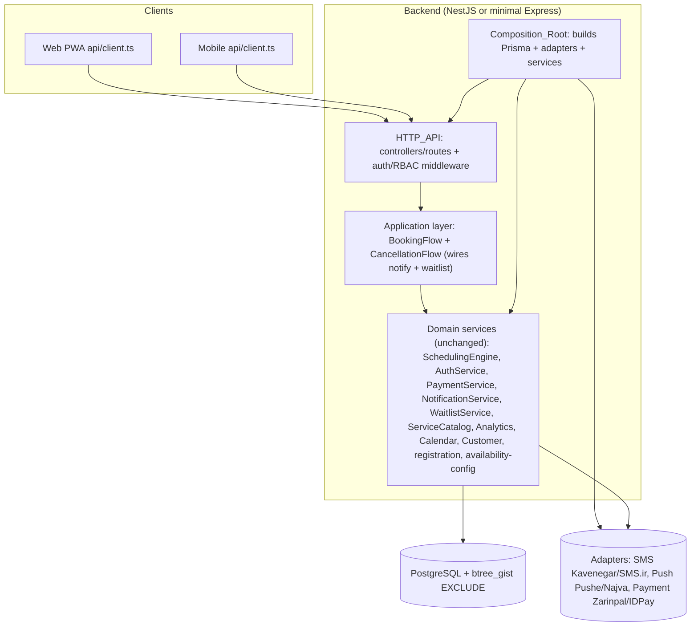

# Design Document

## Overview

The `salon-booking-system` project has a correct domain core but no application around it: there is no HTTP server, no composition root, no cross-service wiring, placeholder external adapters, placeholder UI, and a red test suite. This remediation adds the missing application layer **without rewriting the domain**. The guiding principle is that the existing framework-agnostic services are kept as-is and the remediation *wraps and wires* them.

### What we keep (do not rebuild)

- **Shared pure utilities** — QR codec, Jalali conversion, slot/interval math in `packages/shared`.
- **Scheduling/booking domain logic** — `SchedulingEngine` (`getAvailability`, `book`, `confirmHeld`, `releaseExpiredHolds`), `CancellationService`, and the rest of the domain services. All are plain classes with constructor injection.
- **Database integrity** — the `btree_gist` exclusion-constraint migration that makes the double-resource invariant correct by construction.
- **Payment adapters** — `ZarinpalAdapter` and `IdPayAdapter` are already real `fetch`-based clients; they stay.
- **The 19 property-based tests** — they pass and encode the spec's correctness properties.

### What we add

1. A thin HTTP layer exposing the design's endpoints.
2. A composition root that builds the Prisma client, the adapters, and the services, and injects them into the HTTP layer.
3. A small application layer that wires booking to confirmation and cancellation/expiry to waitlist notification.
4. Real, configuration-driven SMS/push adapters with graceful failure and structured logging.
5. Test hygiene so `npm test` is green offline, plus an opt-in real-PostgreSQL concurrency test and an end-to-end happy-path test.
6. Functional web admin and mobile screens.
7. Accurate docs and configuration.

## Framework Decision Point

The original design specifies **NestJS**. NestJS provides first-class dependency injection, guards (a natural fit for the RBAC matrix), and module boundaries that map cleanly to the six domain modules.

**Decision:** Use NestJS to stay faithful to the original design *if it installs and builds cleanly* in this workspace (Node >= 20, the existing TypeScript/Jest toolchain). The backend currently has **no** web-framework dependency, so NestJS and its platform adapter must be added.

**Fallback:** If NestJS cannot be added cleanly (dependency conflicts, decorator/`reflect-metadata` or `tsconfig` friction with the current build, or excessive footprint), use a **minimal Express layer** that wraps the same services behind hand-written controllers and middleware. The domain services are framework-agnostic, so either choice injects the identical service instances; only the controller/guard glue differs.

This is an explicit decision point. The task plan validates the framework choice first (Task 2) and the README records the outcome and rationale (Requirement 8.4). The rest of the design is written to be framework-neutral: "controller" means a NestJS controller or an Express router, and "guard/middleware" means a NestJS guard or an Express middleware.

## Architecture



### Layering rules

- **HTTP layer** is thin: validate input, resolve the principal, call a service or application-flow method, map the result (or thrown domain error) to an HTTP status + stable error code. No domain logic lives here.
- **Application layer** holds only the *cross-service* orchestration the domain services intentionally do not own: "after a booking is confirmed, send a confirmation" and "after resources free, notify the waitlist head." This keeps `SchedulingEngine` and `CancellationService` framework-agnostic and unit-testable in isolation.
- **Composition_Root** is the only place that does `new` on services and adapters and reads environment configuration. Handlers receive injected instances (via NestJS DI providers or a plain factory passed into Express routers).

## Composition Root

A single factory (for example `createApp(config)`), invoked by a real `main.ts`:

1. Read configuration from environment: `DATABASE_URL`, `JWT_ACCESS_SECRET`, `JWT_REFRESH_SECRET`, gateway keys (Zarinpal merchant id, IDPay API key), SMS/push provider keys, `PAYMENT_CALLBACK_BASE_URL`, and `PORT`.
2. Construct the `PrismaClient`.
3. Select adapters from configuration: a real SMS adapter when keys are present, otherwise a dev/log adapter; likewise for push; choose the payment gateway adapter.
4. Construct every domain service, injecting Prisma, adapters, and config.
5. Construct the application-layer flows (`BookingFlow`, `CancellationFlow`) that hold references to `SchedulingEngine`, `NotificationService`, and `WaitlistService`.
6. Build the HTTP_API, registering controllers/routes and the auth + RBAC middleware, injecting the services/flows.
7. Return the app/server handle so `main.ts` can `listen(PORT)` and so the E2E test can boot it in-process.

If a production-required secret is missing, the root fails fast with a descriptive error; in development it may fall back to documented safe defaults (Requirement 3.5).

## HTTP Layer: Endpoint → Service Mapping

The HTTP layer maps the original design's API surface to service/flow calls. Auth column: *public* = no token; *customer* = valid access token; *role* = RBAC-guarded.

| Method & Path | Handler target | Auth | Remediation / original reqs |
| --- | --- | --- | --- |
| `POST /auth/otp/request` | `AuthService.requestOtp` | public | R2.2 / R1.1, R1.5 |
| `POST /auth/otp/verify` | `AuthService.verifyOtp` | public | R2.2 / R1.2–R1.4 |
| `POST /auth/refresh` | `AuthService.refresh` | refresh token | R2.2 / R1 |
| `GET /salons/by-qr/:payload` | `parseSalonQr` + salon lookup | public | R2.6, R2.7 / R7.2, R7.4, R7.5 |
| `GET /salons/:id/services` | `ServiceCatalog` read | public | R2.2 / R5, R6 |
| `GET /salons/:id/availability` | `SchedulingEngine.getAvailability` | public | R2.7 / R8 |
| `POST /appointments` | `BookingFlow.book` (engine + confirmation) | customer / Admin+Owner | R2, R4.1 / R9, R10.1, R13.1, R12.1 |
| `POST /appointments/:id/cancel` | `CancellationFlow.cancel` (cancel + waitlist notify) | customer / Admin+Owner | R2, R4.2 / R11.1–R11.3, R13.4 |
| `POST /appointments/:id/no-show` | `CancellationService.markNoShow` | Admin / Stylist(own) | R2 / R11.4 |
| `POST /payments/initiate` | `PaymentService.initiateDeposit` | customer | R2 / R10.2 |
| `POST /payments/callback` | `PaymentService.handleCallback` → `BookingFlow.confirm` | gateway (public) | R4.1 / R10.3, R10.6, R12.1 |
| `GET /salons/:id/calendar` | `CalendarService` | Owner/Admin/Stylist | R2 / R15 |
| `GET /salons/:id/analytics` | `AnalyticsService` | Owner | R2 / R16 |
| `GET /salons/:id/staff` | staff read | Owner/Admin | R2 / R3 |
| `GET /salons/:id/chairs` | chair read | Owner/Admin | R2 / R3 |
| `GET /healthz` | liveness | public | R2.1 |

The auth middleware verifies the JWT access token and attaches the principal; the RBAC guard enforces the original authorization matrix (Owner always configures; Admin manages appointments; Stylist views only own appointments/notes). Denials return `403 FORBIDDEN` with no state change.

## Cross-Service Wiring (Application Layer)

The domain services deliberately stop at their own boundary. Two thin flows add the missing orchestration:

### BookingFlow

```
book(req):
  result = SchedulingEngine.book(req)
  if result.status == 'confirmed':
      safelyNotify(() => NotificationService.sendConfirmation(result.appointment.id))   // R4.1 / R12.1
  return result

confirm(appointmentId):                 // called from the payment callback path (R10.3)
  appt = SchedulingEngine.confirmHeld(appointmentId)
  safelyNotify(() => NotificationService.sendConfirmation(appt.id))                       // R4.1 / R12.1
  return appt
```

### CancellationFlow

```
cancel(appointmentId, by):
  appt = CancellationService.cancel(appointmentId)        // frees staff + chair (R11.1)
  safelyNotify(() => WaitlistService.notifyOnFree(appt.salonId, appt.startAt, appt.endAt)) // R4.2 / R13.4
  return appt
```

Hold expiry (`releaseExpiredHolds`, run by the worker) is extended the same way: for each released appointment's window, call `WaitlistService.notifyOnFree` (R4.3 / R13.4).

`safelyNotify` wraps the notification call so a delivery failure is logged but never rolls back the confirmed booking or the resource release (R4.4, consistent with the original R12.4 no-fallback rule). This wiring lives in the application layer, not inside the engine, so `SchedulingEngine` and `CancellationService` stay framework-agnostic and their existing unit/property tests remain valid (R4.5).

## Real External Adapters

The placeholder SMS/push adapters are replaced with real `fetch`-based clients that mirror the already-working `ZarinpalAdapter` pattern:

- **Kavenegar / SMS.ir** implement `SmsProvider.send(phone, message)` by POSTing to the provider endpoint with the configured API key, returning `{ ok: true, providerId }` on success and `{ ok: false, error }` on any failure (no throw).
- **Pushe / Najva** implement `PushProvider.send(token, payload)` analogously.
- Each adapter takes endpoint/credential configuration via its constructor (supplied by the Composition_Root from environment variables) rather than hard-coding secrets.
- Every external call is wrapped with a timeout and a structured log of the outcome (provider, target, ok/fail, error) so failures are observable (R5.3).
- A **dev/log adapter** is selected when credentials are absent, so the app boots and runs locally without provider accounts (R5.5).

## Test Hygiene and Strategy

- **Gate DB tests.** `db-constraints.test.ts` currently constructs `new PrismaClient()` at module load, which throws when `DATABASE_URL` is unset. Move client construction behind a guard and use a conditional `describe` (run when `DATABASE_URL` is present, otherwise `describe.skip`). This makes `npm test` green offline (Requirement 1) while still exercising real constraints in CI when a database is configured.
- **Route tests with supertest.** Add controller/route tests using `supertest` against the app built by the Composition_Root with in-memory or faked service collaborators where a database is not required, asserting status codes, the RBAC matrix, and the error-code mapping.
- **End-to-end happy path.** An opt-in E2E_Test boots the real app in-process against a PostgreSQL test database and drives resolve QR, list availability, create booking, and assert confirmation + dispatched notification (Requirement 6). Skipped gracefully when no database is available (R6.4).
- **Opt-in real-PostgreSQL Property 5.** Add a concurrency test that fires N parallel `book` calls at the last free pair against a real database with the `EXCLUDE` constraints and asserts exactly one confirmation (Requirement 9). The existing mock-based Property 5 remains for offline runs (R9.2).
- **Keep existing tests.** The 19 property tests and the gateway fetch-mock integration tests remain; the latter are demoted from "the only API verification" to adapter-level checks (R6.5).

## Error-Code Mapping

The HTTP layer reuses the original design's stable, localizable error codes so client messages stay consistent.

| Condition | Detection | HTTP response | Error code | Original req |
| --- | --- | --- | --- | --- |
| Expired OTP | `AuthError('OTP_EXPIRED')` | 401 | `OTP_EXPIRED` | 1.3 |
| Wrong OTP | `AuthError('OTP_MISMATCH')` | 401 | `OTP_INVALID` | 1.4 |
| Unauthorized action | RBAC guard denies | 403 | `FORBIDDEN` | 2.4 |
| Invalid service definition | Zod / `CHECK` violation | 400 | `VALIDATION_ERROR` | 5.3, 5.4 |
| No availability at booking | `book` → `rejected: no_availability` | 409 | `BOOKING_NO_AVAILABILITY` | 9.2 |
| Lost race / slot taken | `book` → `rejected: slot_unavailable` | 409 | `BOOKING_SLOT_UNAVAILABLE` | 9.5, 9.6 |
| Malformed QR | `parseSalonQr` → `malformed` | 400 | `QR_MALFORMED` | 7.5 |
| Unregistered QR | token resolves to no salon | 404 | `QR_UNREGISTERED` | 7.4 |
| Payment verification failure | gateway `verify` not ok | 200 with unconfirmed state; release on hold expiry | `PAYMENT_UNVERIFIED` | 10.2, 10.4 |
| SMS delivery failure | adapter returns `ok:false` | logged; no fallback; booking unaffected | (logged) | 12.4 |

`QR_MALFORMED` and `QR_UNREGISTERED` are intentionally distinct so the clients can show distinct messages (original R7.4/R7.5).

## Requirements Coverage Map

| Design area | Remediation requirements |
| --- | --- |
| Test gating + green suite | R1 |
| HTTP framework + bootstrap + endpoints + auth/RBAC + error codes | R2 |
| Composition root | R3 |
| BookingFlow / CancellationFlow wiring | R4 (orig R12.1, R13.4) |
| Real SMS/push adapters | R5 |
| Client API targeting + E2E happy path | R6 |
| Web admin + mobile screens | R7 (orig R15, R16) |
| README + .env.example + package metadata | R8 |
| Opt-in real-PostgreSQL Property 5 | R9 (orig R9.5) |
