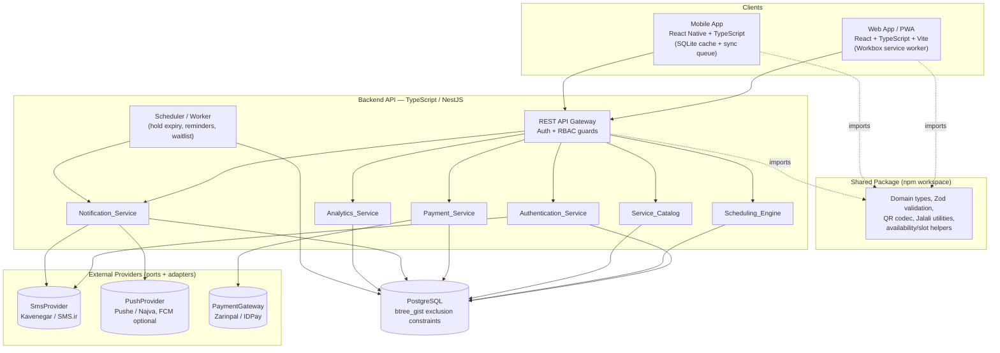
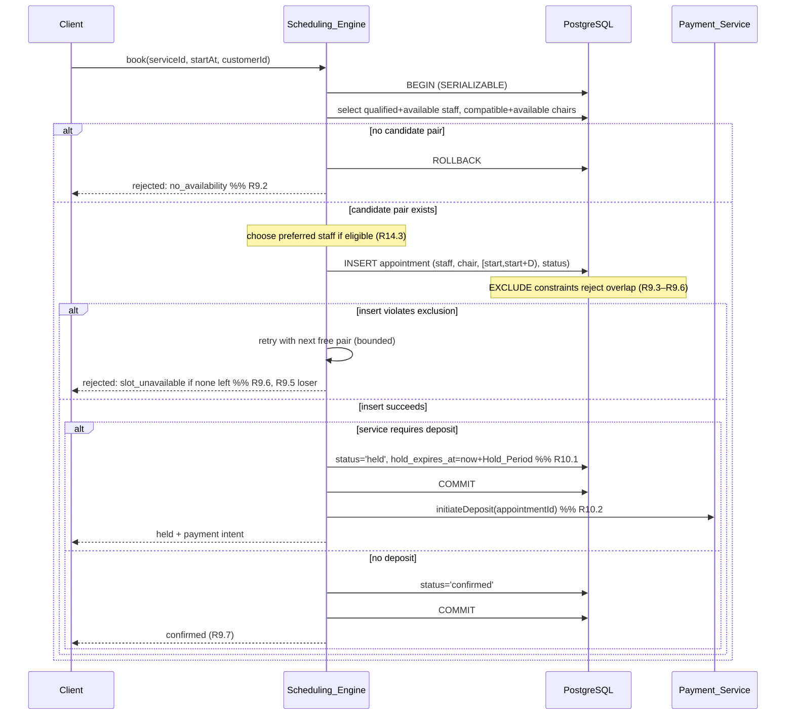
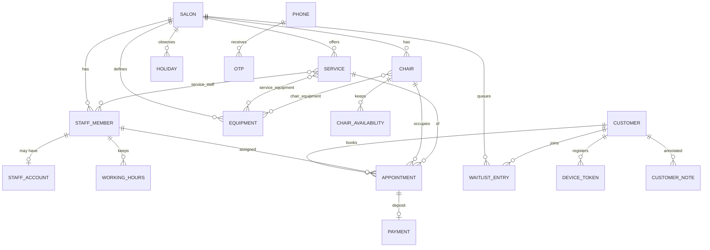

# Design Document

## Overview

The Salon Booking System is a multi-client appointment platform for the Iranian market. It is composed of three deployable surfaces that share a single domain model:

1. **Scheduling web app (PWA)** — used by salon owners, admins, and receptionists to configure resources and manage calendars, and by customers to book through a browser.
2. **React Native mobile app** — used primarily by customers (and optionally stylists), distributed through Cafe Bazaar and Myket, with offline resilience.
3. **Shared backend API** — a TypeScript service hosting the `Scheduling_Engine`, `Authentication_Service`, `Notification_Service`, `Payment_Service`, `Service_Catalog`, and `Analytics_Service`, backed by PostgreSQL.

The defining behavior is the **double-resource constraint**: every `Appointment` reserves exactly one qualified `Staff_Member` **and** exactly one compatible `Chair` for the same continuous interval (service duration plus `Buffer_Time`). The design treats this as a hard data-integrity invariant enforced at the database layer (PostgreSQL exclusion constraints) rather than only in application code, which makes the race condition in Requirement 9.5 and the atomic hold/release in Requirement 10.4 correct by construction.

The design also addresses the market-specific constraints called out in the requirements: Persian/RTL UI, the Jalali calendar with exact round-trip conversion, phone + OTP authentication, local SMS providers as the primary notification channel, local payment gateways (Zarinpal / IDPay) settling in Iranian Rial, distribution via PWA + local Android stores, and tolerance of unstable connectivity.

### Research Summary (decisions that shaped this design)

- **Notifications must be SMS-first.** International SMS routes into Iran are unreliable (for example, Twilio stopped delivering SMS to Iran in March 2025), and push delivery through Google Firebase Cloud Messaging depends on Google Play Services, which is frequently unavailable on Iranian devices. The design therefore makes SMS the primary channel through a local provider (Kavenegar / SMS.ir / Ghasedak, abstracted behind a `SmsProvider` port), and treats push as an additive best-effort channel through a local push provider (Pushe / Najva, abstracted behind a `PushProvider` port) with FCM as an optional adapter. This matches Requirements 12.2 (SMS reminder) and 12.3 (push as an addition). Content rephrased from vendor guidance for licensing compliance.
- **Payment gateways follow a request → redirect → verify flow.** Iranian gateways such as [Zarinpal](https://www.zarinpal.com/) and IDPay issue an `authority`/token on a payment request, redirect the customer to a hosted payment page, then call back to the application, which must explicitly *verify* the transaction. The `Payment_Service` models this two-phase flow behind a `PaymentGateway` port so Zarinpal and IDPay are interchangeable adapters.
- **Jalali conversion uses a proven library.** Date conversion uses `jalaali-js` for the core algorithm (well-tested kernel) and `dayjs` with a Jalali plugin for display formatting, rather than a hand-written converter, to satisfy the exact round-trip requirement (17.4).

## Architecture

### High-Level Component Diagram



### Architectural Style

- **Modular monolith, ports-and-adapters.** The backend is a single deployable NestJS application partitioned into the six domain modules named in the glossary, plus a worker process for scheduled jobs. Each external dependency (SMS, push, payment) is a *port* (interface) with swappable *adapters*. A modular monolith keeps the double-resource transaction inside one database and one process boundary, which is the simplest correct way to enforce the booking invariants; modules can later be extracted to services if needed.
- **Database as the integrity authority.** Overlap prevention is enforced by PostgreSQL `EXCLUDE` constraints, not only by application checks. This removes the classic check-then-insert race entirely.
- **Shared domain code.** A single `shared` package holds domain types, Zod schemas, the QR codec, and Jalali helpers, imported by the backend, the PWA, and the React Native app, so validation and conversions behave identically everywhere.

### Technology Choices and Justification

| Concern | Choice | Justification (mapped to constraints) |
| --- | --- | --- |
| Backend language/runtime | TypeScript on Node.js (NestJS) | Shares types and validation with both clients; NestJS gives clean module boundaries for the six services and first-class DI for ports/adapters. |
| Database | PostgreSQL (+ `btree_gist`) | `tstzrange` + `EXCLUDE` constraints enforce no-overlap per staff and per chair atomically (R9.3–R9.6); ACID transactions and `SERIALIZABLE`/row locking handle the booking race (R9.5); native ranges fit availability math. |
| ORM / migrations | Prisma for models + raw SQL migrations for exclusion constraints | Prisma gives typed data access shared as types; exclusion constraints are declared in SQL migrations because they are beyond ORM schema DSLs. |
| Web client | React + TypeScript + Vite, PWA via Workbox | PWA requirement (R18.1); RTL and Persian via CSS logical properties + i18n; reuses shared package. |
| Mobile client | React Native + TypeScript | Distributable through Cafe Bazaar / Myket (R18.2); shares domain code with web; native modules for SQLite cache and push. |
| Offline cache (mobile) | SQLite (op-sqlite/WatermelonDB) + React Query persistence + outbox queue | Cached appointments offline (R18.3, R18.4); durable submission outbox for failed bookings (R18.5). |
| Localization | i18next (Persian default), `jalaali-js` + `dayjs` Jalali plugin | Persian text and RTL (R17.1, R17.2); Jalali display and exact round-trip (R17.3, R17.4). |
| Auth | JWT access + refresh, OTP hashed at rest | Phone + OTP (R1); stateless RBAC (R2). |
| SMS | `SmsProvider` port; Kavenegar / SMS.ir adapters | Local providers are the only reliable route into Iran (R12 primary channel). |
| Push | `PushProvider` port; Pushe / Najva adapters (FCM optional) | Local push works where Google Play Services is absent (R12.3). |
| Payments | `PaymentGateway` port; Zarinpal / IDPay adapters | Local gateways settling in Rial (R10). |

### Shared Code / Types Strategy

A single repository with npm workspaces (or Turborepo) contains:

```
/packages
  /shared        # domain types, Zod schemas, QR codec, Jalali utils, slot math (pure, no I/O)
  /backend       # NestJS app + worker (depends on shared)
  /web           # React PWA (depends on shared)
  /mobile        # React Native app (depends on shared)
```

Only **pure, side-effect-free** logic lives in `shared`: domain types, validation schemas, the QR encode/parse functions, Jalali conversions, and time-slot helper math. I/O (database, HTTP, gateways) stays in `backend`. This guarantees the same validation rules and conversions run on every surface and keeps the shared package safe to bundle into the browser and the mobile app.

## Components and Interfaces

All interfaces below are expressed in TypeScript and live in the backend, except the pure utilities (`encodeSalonQr`, `parseSalonQr`, `gregorianToJalali`, `jalaliToGregorian`, slot helpers) which live in `shared`.

### Authentication_Service

```typescript
type Role = 'Owner' | 'Admin' | 'Stylist';

interface AuthTokens { accessToken: string; refreshToken: string; }

interface AuthenticationService {
  // R1.1 issue 6-digit OTP; R1.5 invalidate any active OTP for the phone first
  requestOtp(phone: string): Promise<void>;

  // R1.2 accept within 120s; R1.3 reject if expired; R1.4 reject on mismatch
  verifyOtp(phone: string, code: string): Promise<AuthTokens>;

  refresh(refreshToken: string): Promise<AuthTokens>;

  // R2.1 exactly one role per staff account
  createStaffAccount(salonId: string, phone: string, role: Role): Promise<StaffAccount>;
}

// R2.2–R2.6 authorization, enforced as a guard + service-layer check
interface Authorizer {
  can(account: Principal, action: Action, resource: ResourceRef): boolean;
}
```

Authorization matrix (R2):

| Action | Owner | Admin | Stylist |
| --- | --- | --- | --- |
| Configure salon/staff/chairs/services (R2.2, R2.6) | allow (always) | deny | deny (R2.4) |
| Create/modify/cancel appointments (R2.3) | allow | allow | deny |
| View own assigned appointments + customer notes (R2.5) | allow | allow | allow (own only) |

OTP records keep a hashed code, `issued_at`, `expires_at = issued_at + 120s`, and a `consumed_at`. `requestOtp` marks any prior unconsumed OTP for the phone as invalidated before inserting a new one (R1.5).

### Scheduling_Engine

```typescript
interface AvailabilityQuery {
  salonId: string;
  serviceId: string;
  date: string;            // ISO date in salon timezone
  granularityMinutes?: number; // default 15
}

interface TimeSlot { startAt: string; endAt: string; } // endAt = start + duration + buffer

interface BookingRequest {
  salonId: string;
  serviceId: string;
  startAt: string;
  customerId: string;
  preferredStaffId?: string; // R14.3
  source: 'web' | 'mobile' | 'walkin';
}

type BookingResult =
  | { status: 'confirmed'; appointment: Appointment }                 // R9.1, R9.7
  | { status: 'held'; appointment: Appointment; payment: PaymentIntent } // R10.1, R10.2
  | { status: 'rejected'; reason: 'no_availability' | 'slot_unavailable' }; // R9.2, R9.6

interface SchedulingEngine {
  getAvailability(q: AvailabilityQuery): Promise<TimeSlot[]>; // R4, R6, R8
  book(req: BookingRequest): Promise<BookingResult>;          // R9, R10.1, R13.1
  confirmHeld(appointmentId: string): Promise<Appointment>;   // R10.3
  releaseExpiredHolds(now: Date): Promise<number>;            // R10.4 (worker)
  cancel(appointmentId: string, by: Principal): Promise<void>;// R11.1
  markNoShow(appointmentId: string, by: Principal): Promise<void>; // R11.4
}
```

**Availability algorithm (`getAvailability`, R8):**

1. Resolve the qualified staff set = `service_staff(serviceId)` intersected with staff whose configured working hours cover the day and who are not on break/day-off/holiday (R4.4, R4.5, R6.2).
2. Resolve the compatible chair set = chairs providing all required equipment for the service, intersected with chair availability windows minus unavailability and holidays (R4.2, R4.5, R6.3).
3. Let `D = service.duration + service.buffer` (R5.2).
4. Walk candidate starts at `granularityMinutes` across the union of open windows. For interval `[s, s+D)`:
   - `staffFree` = some qualified staff whose working window contains `[s, s+D)` and who has no `held`/`confirmed` appointment overlapping it.
   - `chairFree` = some compatible chair whose availability contains `[s, s+D)` and which has no `held`/`confirmed` appointment overlapping it.
   - Emit the slot iff `staffFree` **and** `chairFree` (R8.1). Exclude intervals where every qualified staff is busy (R8.2) or every compatible chair is busy (R8.3).
5. If no `(staff, chair)` pair is ever simultaneously free, return `[]` (R8.4).

**Booking algorithm (`book`, R9 / R10.1):** executed in a single serializable transaction.



**Concurrency control for R9.5 (the last-pair race):** Two concurrent bookings for the last free `(staff, chair)` pair on an overlapping interval both attempt to `INSERT`. The PostgreSQL exclusion constraints guarantee that at most one row with status `held`/`confirmed` can occupy a given staff or chair over overlapping time. The first transaction commits; the second's insert raises an exclusion violation, which the engine catches and converts to a bounded retry against any *remaining* free pair, and if none remains, returns `rejected: slot_unavailable` (R9.6) — so exactly one booking is confirmed and the other is rejected. This is enforced at the database, independent of application timing, so it holds under true parallelism.

**Atomic hold/release for deposits (R10.4):** Because a held appointment stores **both** `staff_member_id` and `chair_id` on one row, holding occupies both resources with a single insert, and releasing frees both with a single-row status update (`held → expired`). There is no intermediate state where one resource is freed and the other is still held — atomicity is structural. `releaseExpiredHolds` runs in the worker and updates all rows where `status='held' AND hold_expires_at <= now()`.

**Late deposit (R10.6):** `Payment_Service` accepts a payment that arrives after expiry, then calls `confirmHeld`, which re-runs the same availability check inside a transaction before flipping to `confirmed`; if the pair is no longer free, the appointment stays released and the payment is refunded.

### Service_Catalog

```typescript
interface ServiceInput {
  salonId: string; name: string;
  durationMinutes: number;   // R5.3 must be > 0
  bufferMinutes: number;     // R5.4 must be >= 0
  priceRial: number;         // R5.4 must be >= 0
  requiresDeposit: boolean; depositRial?: number;
  requiredEquipmentIds: string[]; // R6.3
}

interface ServiceCatalog {
  createService(input: ServiceInput): Promise<Service>;    // R5.1, R5.3, R5.4
  setServiceStaff(serviceId: string, staffIds: string[]): Promise<void>; // R6.1
  setServiceEquipment(serviceId: string, equipmentIds: string[]): Promise<void>; // R6.3
}
```

Validation rejects non-positive duration and negative buffer/price with a structured validation error (R5.3, R5.4), using a Zod schema shared with the clients so the same rules apply on input forms.

### Payment_Service

```typescript
interface PaymentIntent { paymentId: string; redirectUrl: string; }     // R10.2
interface PaymentGateway {
  request(amountRial: number, callbackUrl: string, meta: object): Promise<{ authority: string; redirectUrl: string; }>;
  verify(authority: string, amountRial: number): Promise<{ ok: boolean; refId?: string; }>;
  refund(refId: string, amountRial: number): Promise<{ ok: boolean; }>;
}

interface PaymentService {
  initiateDeposit(appointmentId: string): Promise<PaymentIntent>;        // R10.2, R10.5
  handleCallback(payload: GatewayCallback): Promise<{ confirmed: boolean }>; // R10.3, R10.6
  refundDeposit(appointmentId: string): Promise<void>;                   // R11.2
  retainDeposit(appointmentId: string): Promise<void>;                   // R11.3
}
```

All amounts are stored and transmitted as integer Iranian Rial (R10.5, R5.1, R16.3). The gateway adapter implements the request/verify/refund flow; verification compares the returned amount against the stored deposit to prevent tampering.

### Notification_Service

```typescript
interface SmsProvider { send(phone: string, message: string): Promise<DeliveryResult>; }
interface PushProvider { send(token: string, payload: PushPayload): Promise<DeliveryResult>; }
type DeliveryResult = { ok: true; providerId: string } | { ok: false; error: string };

interface NotificationService {
  sendConfirmation(appointmentId: string): Promise<void>;  // R12.1
  sendReminder(appointmentId: string): Promise<void>;      // R12.2 (SMS) + R12.3 (push add-on)
  notifyWaitlistHead(windowId: string): Promise<void>;     // R13.4
}
```

`sendReminder` always sends SMS (R12.2); if the customer has enabled push and has a registered device token, it *additionally* sends push (R12.3). On SMS failure it writes a `notification_log` row with `status='failed'` and performs **no** further fallback (R12.4). The worker scans appointments entering the `Reminder_Lead_Time` window and dispatches reminders.

### Analytics_Service

```typescript
interface AnalyticsService {
  chairUtilization(salonId: string, from: Date, to: Date): Promise<UtilizationReport>; // R16.1
  staffUtilization(salonId: string, from: Date, to: Date): Promise<UtilizationReport>; // R16.2
  revenue(salonId: string, from: Date, to: Date): Promise<RevenueReport>;              // R16.3
  busiestWindows(salonId: string, from: Date, to: Date): Promise<WindowReport>;        // R16.4
}
```

Utilization = booked minutes / available minutes over the period, computed per resource from confirmed/completed appointments against configured availability; the value is clamped to `[0, 1]`.

### Shared Utilities (QR codec and Jalali)

```typescript
// R7: QR payload is a versioned deep link carrying an opaque salon token + checksum
function encodeSalonQr(salonToken: string): string;
// returns e.g. "https://book.salon.app/s/v1.<token>.<crc>"

type QrParseResult =
  | { kind: 'ok'; salonToken: string }   // well-formed; caller then resolves the salon
  | { kind: 'malformed' };               // R7.5 unreadable/parse failure

function parseSalonQr(payload: string): QrParseResult; // R7.3 round-trip with encodeSalonQr

// R17: Jalali conversions (jalaali-js kernel)
function gregorianToJalali(d: GregorianDate): JalaliDate;  // R17.3
function jalaliToGregorian(j: JalaliDate): GregorianDate;  // R17.4
```

The QR payload separates **malformed** (fails structural parse / checksum → R7.5) from **unregistered** (parses fine but the token resolves to no salon → R7.4); the API returns distinct error codes so the clients show distinct messages.

### Key API Surface

| Method & Path | Purpose | Auth | Requirements |
| --- | --- | --- | --- |
| `POST /auth/otp/request` | Issue OTP | public | R1.1, R1.5 |
| `POST /auth/otp/verify` | Verify OTP → tokens | public | R1.2–R1.4 |
| `POST /auth/refresh` | Rotate tokens | refresh token | R1 |
| `POST /salons` / `GET /salons/:id` | Create / read salon | Owner / public-read | R3, R7.2 |
| `GET /salons/by-qr/:payload` | Resolve scanned QR | public | R7.2, R7.4, R7.5 |
| `GET /salons/:id/qr` | Fetch salon QR payload/image | Owner | R7.1 |
| `POST /salons/:id/staff` `/chairs` `/equipment` | Register resources | Owner | R3.1, R3.2 |
| `PUT /staff/:id/hours`, `/chairs/:id/hours`, `/salons/:id/holidays` | Availability config | Owner | R4 |
| `POST /salons/:id/services`, `PUT /services/:id/staff`, `/services/:id/equipment` | Catalog | Owner | R5, R6 |
| `GET /salons/:id/availability` | Free slots for service+date | public | R8 |
| `POST /appointments` | Book (online or walk-in) | customer / Admin+Owner | R9, R10.1, R13.1 |
| `POST /appointments/:id/cancel` | Cancel | customer / Admin+Owner | R11.1–R11.3 |
| `POST /appointments/:id/no-show` | Mark no-show | Admin / Stylist (own) | R11.4 |
| `POST /payments/initiate` / `POST /payments/callback` | Deposit request / gateway return | customer / gateway | R10.2, R10.3, R10.6 |
| `POST /salons/:id/waitlist` | Join waitlist | customer | R13.2, R13.3 |
| `GET /customers/me/appointments` | History | customer | R14.1, R18.3 |
| `GET /customers/:id/notes` / `PUT /customers/:id/notes` | Customer notes | Owner/Admin/Stylist | R14.2, R14.4 |
| `GET /salons/:id/calendar` | Day/week views per chair/staff | Owner/Admin/Stylist | R15 |
| `GET /salons/:id/analytics` | Utilization/revenue/busiest | Owner | R16 |

## Data Models

### Entity-Relationship Diagram



### Core Tables (PostgreSQL)

The booking invariants depend on representing each appointment's occupancy as a `tstzrange` and forbidding overlaps per resource.

```sql
CREATE EXTENSION IF NOT EXISTS btree_gist;

CREATE TYPE staff_role     AS ENUM ('Owner','Admin','Stylist');
CREATE TYPE appt_status    AS ENUM ('held','confirmed','cancelled','completed','no_show','expired');
CREATE TYPE appt_source    AS ENUM ('web','mobile','walkin');
CREATE TYPE payment_status AS ENUM ('pending','paid','refunded','retained','failed');

CREATE TABLE salon (
  id          uuid PRIMARY KEY DEFAULT gen_random_uuid(),
  name        text NOT NULL,
  qr_token    text NOT NULL UNIQUE,            -- opaque, unguessable (R7.1)
  timezone    text NOT NULL DEFAULT 'Asia/Tehran',
  created_at  timestamptz NOT NULL DEFAULT now()
);

CREATE TABLE staff_member (
  id          uuid PRIMARY KEY DEFAULT gen_random_uuid(),
  salon_id    uuid NOT NULL REFERENCES salon(id),
  full_name   text NOT NULL,
  role        staff_role NOT NULL,             -- exactly one role (R2.1)
  active      boolean NOT NULL DEFAULT true
);

CREATE TABLE chair (
  id          uuid PRIMARY KEY DEFAULT gen_random_uuid(),
  salon_id    uuid NOT NULL REFERENCES salon(id),
  name        text NOT NULL,
  active      boolean NOT NULL DEFAULT true
);

CREATE TABLE equipment (
  id        uuid PRIMARY KEY DEFAULT gen_random_uuid(),
  salon_id  uuid NOT NULL REFERENCES salon(id),
  name      text NOT NULL
);
CREATE TABLE chair_equipment   (chair_id uuid REFERENCES chair(id),   equipment_id uuid REFERENCES equipment(id), PRIMARY KEY (chair_id, equipment_id));
CREATE TABLE service_equipment (service_id uuid REFERENCES service(id), equipment_id uuid REFERENCES equipment(id), PRIMARY KEY (service_id, equipment_id)); -- R6.3

CREATE TABLE service (
  id              uuid PRIMARY KEY DEFAULT gen_random_uuid(),
  salon_id        uuid NOT NULL REFERENCES salon(id),
  name            text NOT NULL,
  duration_min    int  NOT NULL CHECK (duration_min > 0),   -- R5.3
  buffer_min      int  NOT NULL CHECK (buffer_min >= 0),    -- R5.4
  price_rial      bigint NOT NULL CHECK (price_rial >= 0),  -- R5.1, R5.4
  requires_deposit boolean NOT NULL DEFAULT false,
  deposit_rial    bigint CHECK (deposit_rial >= 0)
);
CREATE TABLE service_staff (service_id uuid REFERENCES service(id), staff_member_id uuid REFERENCES staff_member(id), PRIMARY KEY (service_id, staff_member_id)); -- R6.1

-- Recurring weekly availability; multiple rows model breaks as gaps (R4.1, R4.2)
CREATE TABLE working_hours (
  id          uuid PRIMARY KEY DEFAULT gen_random_uuid(),
  owner_kind  text NOT NULL CHECK (owner_kind IN ('staff','chair')),
  owner_id    uuid NOT NULL,
  weekday     int  NOT NULL CHECK (weekday BETWEEN 0 AND 6),
  start_time  time NOT NULL,
  end_time    time NOT NULL CHECK (end_time > start_time)
);
CREATE TABLE day_off            (id uuid PRIMARY KEY DEFAULT gen_random_uuid(), staff_member_id uuid REFERENCES staff_member(id), on_date date NOT NULL); -- R4.1
CREATE TABLE chair_unavailable  (id uuid PRIMARY KEY DEFAULT gen_random_uuid(), chair_id uuid REFERENCES chair(id), period tstzrange NOT NULL);          -- R4.2
CREATE TABLE holiday            (id uuid PRIMARY KEY DEFAULT gen_random_uuid(), salon_id uuid REFERENCES salon(id), on_date date NOT NULL);              -- R4.3

CREATE TABLE customer (
  id                uuid PRIMARY KEY DEFAULT gen_random_uuid(),
  phone             text NOT NULL UNIQUE,
  full_name         text,
  preferred_staff_id uuid REFERENCES staff_member(id),   -- R14.3
  no_show_count     int NOT NULL DEFAULT 0               -- R11.4
);
CREATE TABLE customer_note (id uuid PRIMARY KEY DEFAULT gen_random_uuid(), customer_id uuid REFERENCES customer(id), author_id uuid, body text NOT NULL, created_at timestamptz NOT NULL DEFAULT now()); -- R14.2, R14.4

CREATE TABLE appointment (
  id              uuid PRIMARY KEY DEFAULT gen_random_uuid(),
  salon_id        uuid NOT NULL REFERENCES salon(id),
  customer_id     uuid NOT NULL REFERENCES customer(id),
  staff_member_id uuid NOT NULL REFERENCES staff_member(id),
  chair_id        uuid NOT NULL REFERENCES chair(id),
  service_id      uuid NOT NULL REFERENCES service(id),
  time_range      tstzrange NOT NULL,            -- [start, start + duration + buffer) (R5.2)
  status          appt_status NOT NULL,
  source          appt_source NOT NULL,
  hold_expires_at timestamptz,                   -- set while status='held' (R10.1)
  created_at      timestamptz NOT NULL DEFAULT now(),

  -- Double-resource no-overlap invariants (R9.3, R9.4, R9.5, R9.6, R13.1)
  CONSTRAINT no_staff_overlap EXCLUDE USING gist (
    staff_member_id WITH =, time_range WITH &&
  ) WHERE (status IN ('held','confirmed')),
  CONSTRAINT no_chair_overlap EXCLUDE USING gist (
    chair_id WITH =, time_range WITH &&
  ) WHERE (status IN ('held','confirmed'))
);

CREATE TABLE payment (
  id              uuid PRIMARY KEY DEFAULT gen_random_uuid(),
  appointment_id  uuid NOT NULL REFERENCES appointment(id),
  amount_rial     bigint NOT NULL CHECK (amount_rial >= 0), -- R10.5
  status          payment_status NOT NULL DEFAULT 'pending',
  gateway         text NOT NULL,                            -- 'zarinpal' | 'idpay'
  authority       text,                                     -- token from request phase
  ref_id          text,                                     -- id from verify phase
  created_at      timestamptz NOT NULL DEFAULT now()
);

-- FIFO waitlist; ordering by (created_at, id) is stable (R13.3, R13.4)
CREATE TABLE waitlist_entry (
  id           uuid PRIMARY KEY DEFAULT gen_random_uuid(),
  salon_id     uuid NOT NULL REFERENCES salon(id),
  customer_id  uuid NOT NULL REFERENCES customer(id),
  service_id   uuid NOT NULL REFERENCES service(id),
  window_range tstzrange NOT NULL,
  status       text NOT NULL DEFAULT 'waiting',  -- waiting|notified|fulfilled|cancelled
  created_at   timestamptz NOT NULL DEFAULT now()
);

CREATE TABLE otp (
  id          uuid PRIMARY KEY DEFAULT gen_random_uuid(),
  phone       text NOT NULL,
  code_hash   text NOT NULL,
  issued_at   timestamptz NOT NULL DEFAULT now(),
  expires_at  timestamptz NOT NULL,             -- issued_at + 120s (R1.2, R1.3)
  consumed_at timestamptz,
  invalidated boolean NOT NULL DEFAULT false     -- R1.5
);

CREATE TABLE device_token (id uuid PRIMARY KEY DEFAULT gen_random_uuid(), customer_id uuid REFERENCES customer(id), token text NOT NULL, platform text NOT NULL, push_enabled boolean NOT NULL DEFAULT true); -- R12.3
CREATE TABLE notification_log (id uuid PRIMARY KEY DEFAULT gen_random_uuid(), appointment_id uuid, channel text NOT NULL, status text NOT NULL, error text, created_at timestamptz NOT NULL DEFAULT now()); -- R12.4
```

### Notes on the schema

- **`time_range` is the occupancy interval** (`start` to `start + duration + buffer`), so the exclusion constraints enforce the buffer automatically (R5.2 + R9).
- **Held and confirmed both occupy resources** (the partial `WHERE status IN ('held','confirmed')`), so a pending deposit hold blocks others exactly like a confirmed booking (R10.1), and releasing is a single status change (R10.4).
- **Walk-ins** are ordinary appointment rows with `source='walkin'`, so they inherit the same exclusion constraints (R13.1).
- **Cancellation / no-show** move `status` to `cancelled`/`no_show`, which drops the row out of the partial index and frees both resources at once (R11.1, R11.4).
- **Money** is `bigint` Rial everywhere (R5.1, R10.5, R16.3).

## Correctness Properties

*A property is a characteristic or behavior that should hold true across all valid executions of a system — essentially, a formal statement about what the system should do. Properties serve as the bridge between human-readable specifications and machine-verifiable correctness guarantees.*

Each property below is universally quantified and is intended to be implemented as a single property-based test. Properties were consolidated from the prework analysis to remove redundancy (for example, the per-staff and per-chair no-overlap rules are unified into one invariant, and the several availability rules are unified into soundness plus consistency).

### Property 1: No double-booking invariant (staff and chair)

*For any* sequence of booking operations (online or walk-in) accepted by the `Scheduling_Engine`, no two appointments in status `held` or `confirmed` share the same `Staff_Member` over overlapping time ranges, and no two such appointments share the same `Chair` over overlapping time ranges.

**Validates: Requirements 9.3, 9.4, 3.3, 3.4, 13.1**

### Property 2: Booking validity / double-resource reservation

*For any* `held` or `confirmed` `Appointment`, it reserves exactly one `Staff_Member` who is mapped to the service and exactly one `Chair` that provides every equipment item the service requires, and its reserved interval length equals the service duration plus the service `Buffer_Time`.

**Validates: Requirements 9.1, 5.2, 6.2, 6.3**

### Property 3: Availability soundness

*For any* availability query, every returned `Time_Slot` has at least one qualified `Staff_Member` and at least one compatible `Chair` both free for the full duration-plus-buffer interval, with no part outside configured working hours, inside a break, on a day off, on a chair-unavailable period, or on a salon holiday; and when no qualified-and-free staff with a compatible-and-free chair exists, the result is empty.

**Validates: Requirements 8.1, 8.2, 8.3, 8.4, 4.4, 4.5**

### Property 4: Availability–booking consistency

*For any* system state, a `Time_Slot` returned by availability can be booked successfully when attempted in isolation, and a booking attempt for an interval with no simultaneously free qualified-staff/compatible-chair pair is rejected with a no-availability/slot-unavailable result.

**Validates: Requirements 9.2, 9.6, 8.1**

### Property 5: Booking race safety (concurrency)

*For any* two or more booking requests submitted concurrently for the last remaining free `(Staff_Member, Chair)` pair over overlapping intervals, exactly one request is confirmed and all others are rejected.

**Validates: Requirements 9.5**

### Property 6: Atomic hold and release

*For any* `held` `Appointment` whose `Hold_Period` has elapsed without a confirmed deposit, releasing it frees the `Staff_Member` and the `Chair` together: after release neither resource is occupied by that appointment and both are bookable for the interval, and there is no observable state in which one resource is freed while the other remains held.

**Validates: Requirements 10.4, 10.1**

### Property 7: Late-deposit re-verification

*For any* deposit confirmed after the `Hold_Period` has elapsed, the `Appointment` becomes `confirmed` only if a qualified `Staff_Member` and a compatible `Chair` are free at confirmation time; otherwise the appointment remains released and the payment is refunded.

**Validates: Requirements 10.6**

### Property 8: Cancellation and no-show free resources

*For any* `confirmed` `Appointment`, cancelling it or marking it as a `No_Show` removes its occupancy so that its `Staff_Member` and `Chair` become available again for that time window, and a no-show additionally increments the customer's recorded no-show count.

**Validates: Requirements 11.1, 11.4**

### Property 9: Deposit refund policy

*For any* `Appointment` with a paid deposit, cancelling strictly before the `Cancellation_Window` refunds the deposit, and cancelling within the `Cancellation_Window` retains the deposit.

**Validates: Requirements 11.2, 11.3**

### Property 10: Service-definition validation

*For any* proposed `Service` definition, the `Service_Catalog` rejects it with a validation error when the duration is non-positive or the `Buffer_Time` is negative or the price is negative, and accepts it otherwise.

**Validates: Requirements 5.3, 5.4**

### Property 11: QR payload round-trip and malformed detection

*For any* salon token, parsing the payload produced by encoding that token recovers the original token; and *for any* structurally malformed payload, parsing reports a malformed result (distinct from the unregistered-salon outcome).

**Validates: Requirements 7.1, 7.3, 7.5**

### Property 12: Jalali calendar round-trip

*For any* valid Gregorian date, converting it to a `Jalali_Calendar` date and back yields the original Gregorian date exactly.

**Validates: Requirements 17.4**

### Property 13: Waitlist FIFO ordering

*For any* sequence of customers joining the `Waitlist` for a window, the stored order equals the join order, and when a `(Staff_Member, Chair)` pair becomes free the earliest-joined waiting customer is the one notified first.

**Validates: Requirements 13.3, 13.4**

### Property 14: OTP validity window and latest-only

*For any* issued `OTP`, an authentication attempt succeeds only when the submitted code matches the most recently issued, not-yet-superseded code and is submitted within 120 seconds of issuance; expired, mismatched, or superseded codes are rejected and leave the customer unauthenticated.

**Validates: Requirements 1.2, 1.3, 1.4, 1.5**

### Property 15: Role-based authorization matrix

*For any* staff account role and any action, authorization matches the defined matrix: an `Owner` is always permitted to configure the salon and to manage appointments; an `Admin` is permitted to manage appointments but not to change salon configuration; a `Stylist` is permitted to view only their own assigned appointments and customer notes and is denied configuration changes (leaving configuration unchanged).

**Validates: Requirements 2.2, 2.3, 2.4, 2.5, 2.6, 14.4**

### Property 16: Utilization and revenue correctness

*For any* set of appointments and configured availability over a period, the chair and staff utilization each equal booked time divided by available time and lie within the closed interval [0, 1], the revenue summary equals the sum of in-period completed appointment prices in Iranian Rial, and the reported busiest window has the maximum concurrent-appointment count.

**Validates: Requirements 16.1, 16.2, 16.3, 16.4**

### Property 17: Reminder channel selection

*For any* customer with an appointment entering the `Reminder_Lead_Time` window, an SMS reminder is dispatched, and a push reminder is additionally dispatched if and only if that customer has push enabled with a registered device.

**Validates: Requirements 12.2, 12.3**

### Property 18: Preferred-staff preselection

*For any* booking where the customer's preferred `Staff_Member` is mapped to the selected service and is free for the requested `Time_Slot`, the `Booking_System` preselects that preferred `Staff_Member`.

**Validates: Requirements 14.3**

### Property 19: Offline submission preservation

*For any* booking submission that fails because of a network error, the submission is preserved unchanged in the mobile app's local outbox and the failure is reported to the customer, so the preserved submission is recoverable.

**Validates: Requirements 18.5**

## Error Handling

The system distinguishes recoverable user-facing conditions from internal faults and maps each to a stable, localizable error code.

| Condition | Detection | Response | Requirements |
| --- | --- | --- | --- |
| Expired OTP | `expires_at < now()` at verify | `OTP_EXPIRED`; prompt to request a new code | 1.3 |
| Wrong OTP | code hash mismatch | `OTP_INVALID`; remain unauthenticated; rate-limit attempts | 1.4 |
| Unauthorized action | RBAC guard denies | `403 FORBIDDEN`; no state change | 2.4 |
| Invalid service definition | Zod + DB `CHECK` | `400 VALIDATION_ERROR` listing offending fields | 5.3, 5.4 |
| No availability at booking | empty candidate set in txn | `BOOKING_NO_AVAILABILITY` | 9.2 |
| Lost race / slot taken | exclusion-constraint violation after retries | `BOOKING_SLOT_UNAVAILABLE` | 9.5, 9.6 |
| Malformed QR | structural/checksum parse failure | `QR_MALFORMED` (distinct message) | 7.5 |
| Unregistered QR | token resolves to no salon | `QR_UNREGISTERED` (distinct message) | 7.4 |
| Payment verification failure | gateway `verify` returns not-ok | keep appointment unconfirmed; surface retry; release on hold expiry | 10.2, 10.4 |
| SMS delivery failure | provider returns not-ok | write `notification_log` failure; no fallback | 12.4 |
| Offline booking submission | client network error | enqueue in outbox; show failure notice | 18.5 |
| Offline app open, no cache | empty local cache | empty-state screen | 18.4 |

Cross-cutting rules: the booking transaction uses `SERIALIZABLE` isolation with bounded retries; exclusion-constraint violations are caught and translated to domain rejections rather than surfaced as 500s; all external-provider calls (SMS, push, gateway) are wrapped with timeouts and logged outcomes; money and date conversions never silently coerce — invalid inputs raise validation errors.

## Testing Strategy

The strategy combines example-based unit tests, property-based tests, a dedicated concurrency harness, and a small set of integration/smoke tests for the external edges. PBT is appropriate here because the core of the system is pure logic over large input spaces (scheduling, conversions, ordering, arithmetic).

### Property-based tests

- Use **fast-check** (TypeScript) for all property tests, since the backend and shared logic are TypeScript.
- Each property in the Correctness Properties section maps to **exactly one** property-based test, configured to run a **minimum of 100 iterations**.
- Each property test is tagged with a comment in the format: **Feature: salon-booking-system, Property {number}: {property text}**.
- Generators model the domain: salons with staff/chairs/equipment/services, working-hours/holiday schedules, booking sequences (including walk-ins), OTP issuance/verify offsets, Gregorian dates across a wide range, QR tokens and malformed strings, waitlist join sequences, and customer push configurations.
- Properties that touch external ports (SMS, push, payment) use in-memory fakes so input variation tests the logic, not the provider (Properties 7, 9, 17).

### Concurrency testing (Property 5)

- A harness fires N parallel `book` calls against a real PostgreSQL instance (with the exclusion constraints in place) targeting the last free pair, then asserts exactly one `confirmed` and the rest rejected. Repeated across many seeds and N values. This validates the database-level guarantee rather than mocked logic.

### Unit tests (examples, edge cases, error conditions)

- OTP 6-digit generation and dispatch (1.1), success-confirmation payload (9.7), gateway request-before-confirm and callback transitions (10.2, 10.3), SMS-failure logging with no fallback (12.4), QR distinct messages for malformed vs unregistered (7.4/7.5), waitlist offer when full (13.2), preferred-staff non-preselection when ineligible (14.3 negative), offline cached display and empty state (18.3, 18.4), calendar reflects mutations (15.3).

### Integration and smoke tests

- Integration (1–3 examples): Zarinpal/IDPay adapter request→verify against sandbox or recorded fixtures; Kavenegar/SMS.ir adapter send; push adapter send.
- Smoke (single execution): PWA manifest + service-worker registration (18.1), React Native release build configuration for Cafe Bazaar/Myket (18.2), Persian i18n default bundle and RTL root direction (17.1, 17.2).

### Database-constraint tests

- Direct tests that inserting overlapping `held`/`confirmed` rows for the same staff or chair is rejected by `no_staff_overlap` / `no_chair_overlap`, and that moving an appointment to `cancelled`/`no_show`/`expired` frees the resource (supports Properties 1, 6, 8).

## Requirements Coverage Map

| Design area | Requirements addressed |
| --- | --- |
| Architecture + technology choices | 17.1, 17.2, 18.1, 18.2 |
| Authentication_Service + Authorizer | 1.1–1.5, 2.1–2.6 |
| Service_Catalog | 5.1–5.4, 6.1–6.3 |
| Scheduling_Engine (availability) | 4.1–4.5, 6.2, 6.3, 8.1–8.4 |
| Scheduling_Engine (booking + concurrency) | 3.3, 3.4, 9.1–9.7, 13.1 |
| Payment_Service + hold/release | 10.1–10.6, 11.2, 11.3 |
| Cancellation / no-show | 11.1, 11.4 |
| Notification_Service + worker | 12.1–12.4, 13.4 |
| Waitlist | 13.2, 13.3, 13.4 |
| Customer profile / history | 14.1–14.4 |
| Admin calendar views | 15.1–15.3 |
| Analytics_Service | 16.1–16.4 |
| Shared QR codec | 7.1–7.5 |
| Shared Jalali utilities | 17.3, 17.4 |
| Mobile offline cache + outbox | 18.3, 18.4, 18.5 |
| Data model + exclusion constraints | 3.1, 3.2, 9.3, 9.4, 10.4 |
