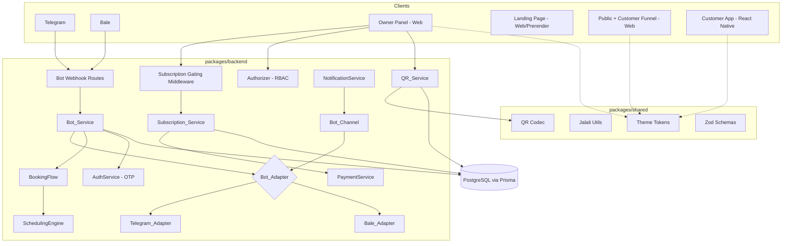
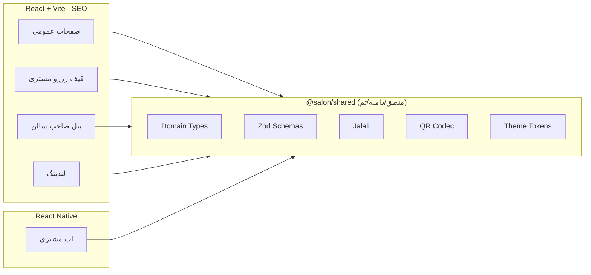
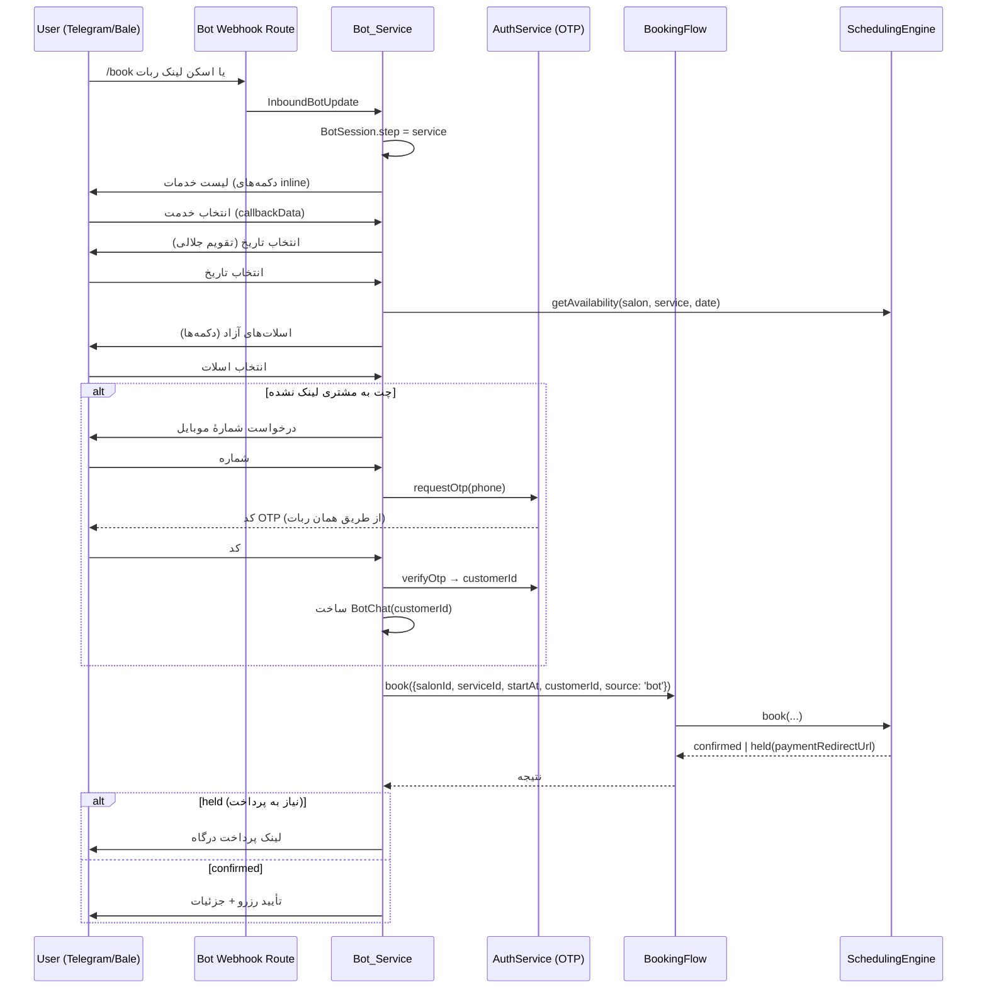
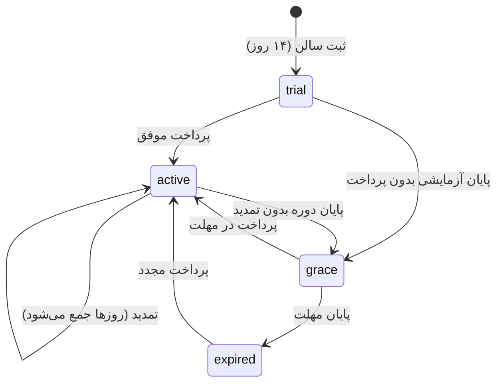
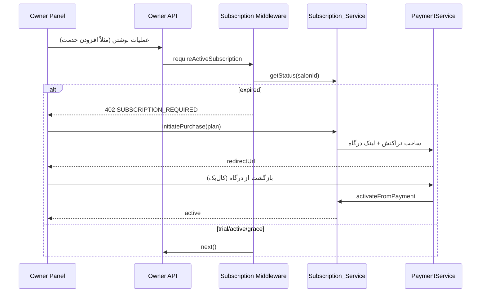

# Design Document

> Spec: Salon Platform Expansion (توسعه پلتفرم سالن)

## Overview

این سند، طراحی فنی شش قابلیت جدید تعریف‌شده در `requirements.md` را ارائه می‌دهد: کانال اعلان و رزرو مبتنی بر ربات (تلگرام و بله)، پنل تحت‌وب صاحب سالن، سامانهٔ اشتراک، تولید QR پایدار سالن، صفحهٔ فرود بازاریابی، و تثبیت تصمیم معماری اشتراک‌گذاری کد.

اصل حاکم بر کل طراحی: **بازاستفاده، نه بازنویسی**. هر قابلیت جدید روی مؤلفه‌های موجود سوار می‌شود:

| قابلیت جدید | مؤلفهٔ موجود که بازاستفاده می‌شود |
| --- | --- |
| رزرو داخل ربات | `SchedulingEngine` + `BookingFlow` (بدون منطق رزرو تکراری) |
| کانال اعلان ربات | انتزاع `NotificationService` + الگوی `SmsProvider` |
| ورود به پنل/ربات | `AuthService` (OTP) + JWT موجود |
| کنترل دسترسی پنل | `Authorizer` (RBAC: Owner/Admin/Stylist) |
| پرداخت اشتراک | `PaymentService` (ZarinPal/IDPay) |
| تولید QR | کدک QR در `@salon/shared` + فیلد `Salon.qrToken` |
| تاریخ/عدد/ریال | ابزارهای جلالی و فرمت‌کننده‌های `@salon/shared` |
| تزریق وابستگی | `composition-root.ts` (تنها جای `new`) |

پیکربندی اسرار از الگوی fail-fast موجود در `config.ts` پیروی می‌کند: مقادیر دِو پیش‌فرض امن دارند؛ نبودِ توکن یک پلتفرم پیام‌رسان آن کانال را به‌آرامی غیرفعال می‌کند (مثل انتخاب `DevLogSmsProvider` وقتی کلید پیامک نیست).

## Architecture

### نمای کلان مؤلفه‌ها



### تصمیم معماری اشتراک کد (نیازمندی ۶)



- صفحات عمومی، قیف مشتری، پنل صاحب سالن و لندینگ → **وب React موجود** (برای SEO).
- اپ موبایل مشتری → **React Native** (بدون تغییر پلتفرم).
- **React Native for Web استفاده نمی‌شود** برای هیچ صفحهٔ عمومی/SEO (نیازمندی ۶ بند ۱): خروجی سنگین JS به قابلیت خزش آسیب می‌زند.
- اشتراک کد فقط در لایهٔ `@salon/shared` (تایپ‌ها، اسکیما، جلالی، QR، توکن‌های تم). هیچ CSS وب به RN نشت نمی‌کند؛ تنها مقادیر توکن مشترک‌اند.

## Data Models

تمام تغییرات افزایشی‌اند (additive — مهاجرت‌های Prisma بدون شکستن جداول موجود). مبالغ پولی `BigInt` (ریال) مطابق `Service.priceRial`.

```prisma
// ─── Bot identity link ──────────────────────────────────────────────
enum BotPlatform {
  telegram
  bale
}

// شناسهٔ گفت‌وگوی ربات برای یک مشتری یا یک عضو staff (صاحب سالن).
// یکی از customerId یا staffMemberId پر است.
model BotChat {
  id            String      @id @default(uuid()) @db.Uuid
  platform      BotPlatform
  chatId        String      @map("chat_id")          // شناسهٔ چت در آن پلتفرم
  customerId    String?     @map("customer_id") @db.Uuid
  staffMemberId String?     @map("staff_member_id") @db.Uuid
  linkedAt      DateTime    @default(now()) @map("linked_at") @db.Timestamptz

  customer    Customer?    @relation(fields: [customerId], references: [id])
  staffMember StaffMember? @relation(fields: [staffMemberId], references: [id])

  @@unique([platform, chatId])
  @@map("bot_chat")
}

// وضعیت گفت‌وگوی رزرو داخل ربات (ماشین حالت، سروری نگه‌داری می‌شود).
model BotSession {
  id         String      @id @default(uuid()) @db.Uuid
  platform   BotPlatform
  chatId     String      @map("chat_id")
  step       String                                   // service|date|slot|confirm|otp|done
  draftJson  Json        @map("draft_json")           // {salonId, serviceId, date, startAt}
  updatedAt  DateTime    @updatedAt @map("updated_at") @db.Timestamptz

  @@unique([platform, chatId])
  @@map("bot_session")
}

// ─── Subscription ───────────────────────────────────────────────────
enum SubscriptionStatus {
  trial
  active
  grace
  expired
}

enum SubscriptionPlanKind {
  trial
  monthly
  quarterly
  annual
}

model Subscription {
  id            String              @id @default(uuid()) @db.Uuid
  salonId       String              @unique @map("salon_id") @db.Uuid
  status        SubscriptionStatus  @default(trial)
  planKind      SubscriptionPlanKind @default(trial) @map("plan_kind")
  startedAt     DateTime            @default(now()) @map("started_at") @db.Timestamptz
  expiresAt     DateTime            @map("expires_at") @db.Timestamptz
  graceUntil    DateTime?           @map("grace_until") @db.Timestamptz
  createdAt     DateTime            @default(now()) @map("created_at") @db.Timestamptz

  salon    Salon                  @relation(fields: [salonId], references: [id])
  payments SubscriptionPayment[]

  @@map("subscription")
}

// پرداخت اشتراک — جدا از Payment رزرو، اما از همان PaymentService استفاده می‌کند.
model SubscriptionPayment {
  id             String        @id @default(uuid()) @db.Uuid
  subscriptionId String        @map("subscription_id") @db.Uuid
  planKind       SubscriptionPlanKind @map("plan_kind")
  amountRial     BigInt        @map("amount_rial")
  status         PaymentStatus @default(pending)
  gateway        String
  authority      String?
  refId          String?       @map("ref_id")
  createdAt      DateTime      @default(now()) @map("created_at") @db.Timestamptz

  subscription Subscription @relation(fields: [subscriptionId], references: [id])

  @@map("subscription_payment")
}

// ─── QR scan counting ───────────────────────────────────────────────
model QrScanEvent {
  id        String   @id @default(uuid()) @db.Uuid
  salonId   String   @map("salon_id") @db.Uuid
  source    String                                    // utm_source, e.g. "qr"
  createdAt DateTime @default(now()) @map("created_at") @db.Timestamptz

  salon Salon @relation(fields: [salonId], references: [id])

  @@map("qr_scan_event")
}
```

روابط معکوس افزوده‌شده به مدل‌های موجود (بدون تغییر شکست‌زا): `Customer.botChats`, `StaffMember.botChats`, `Salon.subscription`, `Salon.qrScanEvents`. به‌دلیل ثابت‌بودن مقدار `enum`‌ها، نیازی به SQL خام نیست؛ همهٔ تغییرات از طریق `prisma migrate`/`db push` اعمال می‌شوند.

## Components and Interfaces

### ۱) ربات‌ها: Bot_Adapter / Bot_Service / Bot_Channel

#### واسط آداپتور (انتزاع مشترک)

```typescript
/** پیام خروجی مستقل از پلتفرم. */
export interface OutboundBotMessage {
  chatId: string;
  text: string;
  /** دکمه‌های inline اختیاری برای انتخاب خدمت/تاریخ/اسلات. */
  buttons?: Array<{ label: string; data: string }>;
}

/** به‌روزرسانی ورودی نرمال‌شده از وبهوک هر پلتفرم. */
export interface InboundBotUpdate {
  platform: BotPlatform;
  chatId: string;
  text?: string;
  /** payload دکمهٔ inline که کاربر زد. */
  callbackData?: string;
}

/** آداپتور هر پلتفرم پیام‌رسان. تلگرام و بله ساختاری مشابه دارند. */
export interface BotAdapter {
  readonly platform: BotPlatform;
  /** آیا توکن تنظیم شده و آداپتور فعال است. */
  readonly enabled: boolean;
  /** ارسال پیام؛ هم‌تراز با SmsProvider.send. */
  send(message: OutboundBotMessage): Promise<{ ok: boolean; error?: string }>;
  /** نرمال‌سازی بدنهٔ خام وبهوک به InboundBotUpdate. */
  parseUpdate(raw: unknown): InboundBotUpdate | null;
}
```

`Telegram_Adapter` و `Bale_Adapter` این واسط را پیاده می‌کنند. بله از نظر API بسیار شبیه تلگرام است، پس بخش زیادی از منطق در یک کلاس پایهٔ مشترک قرار می‌گیرد و فقط `baseUrl`/قالب payload متفاوت override می‌شود.

#### Bot_Channel (اتصال به انتزاع اعلان موجود)

`Bot_Channel` هم‌تراز با `SmsProvider` پشت `NotificationService` می‌نشیند تا OTP، یادآوری و اعلان رزرو/لغو از طریق ربات هم ارسال شوند. `NotificationService` بر اساس وجود `BotChat` برای گیرنده تصمیم می‌گیرد کانال ربات را امتحان کند؛ در صورت نبود `BotChat` یا غیرفعال‌بودن آداپتور، به پیامک برمی‌گردد (fallback) و در `NotificationLog` ثبت می‌شود.

#### ماشین حالت رزرو داخل چت



نکات کلیدی:
- منطق رزرو **تکرار نمی‌شود**؛ `Bot_Service` همان `BookingFlow.book(...)` را صدا می‌زند (با `source: 'bot'` که به enum `ApptSource` افزوده می‌شود — تغییر افزایشی).
- وضعیت گفت‌وگو در `BotSession` سروری نگه‌داری می‌شود (نه در حافظهٔ پروسه) تا با ری‌استارت/مقیاس افقی پایدار بماند.
- هویت: اگر چت به مشتری لینک نباشد، همان جریان OTP موجود داخل چت اجرا می‌شود و `BotChat` ساخته می‌شود.

#### مسیردهی وبهوک

- `POST /api/bots/telegram/:secret` و `POST /api/bots/bale/:secret` — مسیرهای **عمومی** (بدون `requireAuth`)، اما با یک مسیر مخفی/توکن وبهوک محافظت‌شده تا فقط پلتفرم پیام‌رسان بتواند فراخوانی کند. هر دو به `Bot_Service.handleUpdate(platform, rawBody)` می‌رسند.
- توکن‌ها و secret وبهوک از `config.ts` (افزودن فیلدهای `telegramBotToken`, `baleBotToken`, `botWebhookSecret`) خوانده می‌شوند؛ نبودِ توکن → آن آداپتور `enabled=false`.

### ۲) پنل صاحب سالن (وب)

- مسیر جدید `/owner/*` در `packages/web` (lazy/code-split، خارج از باندل صفحات عمومی).
- ورود با همان OTP موجود؛ توکن دسترسی موجود استفاده می‌شود. بوت‌استرپ توکن از refresh در startup (همان شکافی که قبلاً در client.ts اشاره شد — اینجا حل می‌شود تا رفرش صفحه کاربر را بیرون نیندازد).
- کنترل دسترسی با `Authorizer` موجود؛ نقش `Owner`/`Admin` به پنل دسترسی دارد، `Stylist` فقط نمای محدود.
- صفحات پنل = گسترش صفحات admin موجود (`ConfigurationPage`/`CalendarPage`/`AnalyticsPage`) + صفحات جدید: «اشتراک من» و «QR و استند».
- گیت اشتراک: یک wrapper سمت کلاینت + middleware سمت سرور (پایین). اگر اشتراک `expired` باشد، پنل به صفحهٔ تمدید هدایت می‌شود (نمای فقط‌خواندنی مجاز نیست برای عملیات نوشتن).
- قرارداد `dir="rtl"`/`lang="fa"` و توکن‌های UI حاکم حفظ می‌شوند.

### ۳) سامانهٔ اشتراک

#### واسط سرویس

```typescript
export interface PlanDefinition {
  kind: SubscriptionPlanKind;
  durationDays: number;
  priceRial: bigint;       // configurable
}

export interface SubscriptionService {
  /** شروع آزمایشی هنگام ثبت سالن. */
  startTrial(salonId: string): Promise<Subscription>;
  /** آغاز خرید: ساخت SubscriptionPayment + لینک درگاه (PaymentService). */
  initiatePurchase(salonId: string, plan: SubscriptionPlanKind): Promise<{ redirectUrl: string }>;
  /** کال‌بک پرداخت موفق: فعال‌سازی/تمدید. */
  activateFromPayment(subscriptionPaymentId: string): Promise<Subscription>;
  /** وضعیت مؤثر فعلی (با لحاظ انقضا/grace). */
  getStatus(salonId: string): Promise<SubscriptionStatus>;
}
```

#### ماشین حالت



- پلن‌های پیش‌فرض (قیمت‌ها configurable از env/جدول پیکربندی):
  - **آزمایشی:** ۱۴ روز، رایگان.
  - **ماهانه:** ۳۰ روز.
  - **سه‌ماهه:** ۹۰ روز (تخفیف نسبت به ماهانه).
  - **سالانه:** ۳۶۵ روز (بیشترین تخفیف — اهرم ماندگاری).
- تمدید: `durationDays` پلن جدید به `expiresAt` باقیمانده افزوده می‌شود (روزهای باقیمانده از دست نمی‌رود — نیازمندی ۳ بند ۱۱).
- درآمد فقط اشتراکی (نیازمندی ۳ بند ۱۲)؛ هیچ کمیسیون رزرو.
- پرداخت از همان `PaymentService` (ZarinPal/IDPay) با یک نوع تراکنش `subscription` استفاده می‌کند.

#### Middleware گیت‌کردن

```typescript
// روی روترهای پنل/نوشتن صاحب سالن اعمال می‌شود.
function requireActiveSubscription(subscriptionService): RequestHandler {
  return async (req, res, next) => {
    const salonId = resolveSalonIdFromPrincipal(req.principal!);
    const status = await subscriptionService.getStatus(salonId);
    if (status === 'expired') {
      res.status(402).json({ code: 'SUBSCRIPTION_REQUIRED' });
      return;
    }
    next(); // trial / active / grace اجازه دارند
  };
}
```



### ۴) تولید QR + استند

```typescript
export interface QrService {
  /** payload پایدار سالن از qrToken موجود + کدک shared. */
  buildSalonQrPayload(salonId: string): Promise<string>;
  /** نشانی مقصد با پارامتر کمپین. */
  buildSalonQrUrl(slug: string, source?: string): string; // افزودن utm_source=qr
  /** ثبت رویداد اسکن برای شمارش. */
  recordScan(salonId: string, source: string): Promise<void>;
}
```

- payload از `Salon.qrToken` موجود و کدک `@salon/shared` ساخته می‌شود (بازنویسی نمی‌شود — نیازمندی ۴ بند ۲).
- QR **پایدار به‌ازای سالن** است (نه per-customer)؛ یک‌بار تولید، بارها استفاده.
- مقصد: پروفایل عمومی `/s/:slug?utm_source=qr` (یا مستقیم قیف). صفحهٔ عمومی هنگام بارگذاری با پارامتر کمپین، `QrService.recordScan` را از طریق یک endpoint سبک صدا می‌زند (یا میدلور سمت سرور رویداد را ثبت می‌کند).
- **صفحهٔ استند** `/owner/qr`: نمای چاپ‌دوست (تصویر QR بزرگ + نام سالن + دعوت به اسکن) با `@media print`؛ صاحب سالن می‌تواند کارت/استند را چاپ کند.
- تولید تصویر QR سمت کلاینت در پنل (کتابخانهٔ سبک QR در همان چانک پنل، نه در باندل عمومی).

### ۵) صفحهٔ فرود (لندینگ)

- مسیر مستقل (مثلاً `/business` یا یک ساب‌دامین در دیپلوی) با تمرکز بر جذب **صاحبان سالن**.
- روی همان زیرساخت prerender/SEO موجود ساخته می‌شود: محتوا + متادیتا + JSON-LD در HTML اولیه (نیازمندی ۵ بند ۴).
- CTA صاحب سالن → مسیر ثبت‌نام/پنل (`/owner`)؛ بازدیدکنندهٔ مشتری → قیف رزرو/صفحهٔ عمومی.
- رعایت `dir=rtl`/`lang=fa` و `seo-skills.md`.

## Configuration (افزوده به config.ts)

```typescript
// افزوده به AppConfig (همه اختیاری در دِو؛ نبودشان کانال را غیرفعال می‌کند):
telegramBotToken?: string;   // TELEGRAM_BOT_TOKEN
baleBotToken?: string;       // BALE_BOT_TOKEN
botWebhookSecret?: string;   // BOT_WEBHOOK_SECRET
// قیمت پلن‌ها (configurable):
subMonthlyRial?: string;     // SUB_MONTHLY_RIAL
subQuarterlyRial?: string;   // SUB_QUARTERLY_RIAL
subAnnualRial?: string;      // SUB_ANNUAL_RIAL
subTrialDays?: string;       // SUB_TRIAL_DAYS (default 14)
```

انتخاب آداپتورها در `composition-root.ts` با همان الگوی `selectSmsProvider` انجام می‌شود: اگر توکن باشد آداپتور واقعی، وگرنه آداپتور غیرفعال/no-op.

## Error Handling

- **ربات:** خطای ارسال یا parse نباید پروسه را بشکند؛ در `NotificationLog` ثبت و در صورت امکان fallback به پیامک. وبهوک همیشه `200` برمی‌گرداند تا پلتفرم retry طوفانی نکند؛ خطاها داخلی لاگ می‌شوند.
- **اشتراک:** پرداخت ناموفق → اشتراک بدون تغییر می‌ماند و خطای کاربرپسند نمایش داده می‌شود؛ کال‌بک idempotent است (یک `SubscriptionPayment` دوبار فعال‌سازی نمی‌کند).
- **گیت:** `402 SUBSCRIPTION_REQUIRED` برای منقضی؛ خواندن مجاز، نوشتن مسدود.
- **QR:** payload نامعتبر → همان دو حالت متمایز موجود (`malformed` vs `unregistered`) در صفحهٔ QR landing.

## Correctness Properties

این ویژگی‌ها باید همیشه برقرار بمانند و مبنای تست‌های مبتنی بر ویژگی (property-based) و یکپارچه‌اند:

### Property 1: یکتایی هویت چت
برای هر `(platform, chatId)` حداکثر یک `BotChat` و یک `BotSession` وجود دارد.
**Validates: Requirements 1.6**

### Property 2: تک‌منبع رزرو
هر رزرو ربات از مسیر `BookingFlow.book` می‌گذرد؛ هیچ مسیر رزروی قواعد زمان‌بندی را دور نمی‌زند (هیچ overlap نقض exclusion constraint‌های موجود نمی‌شود).
**Validates: Requirements 1.6, 6.6**

### Property 3: عدم نشت OTP/توکن
هیچ توکن ربات یا کد OTP در لاگ‌ها، پاسخ‌ها یا رویدادهای آنالیتیکس ظاهر نمی‌شود.
**Validates: Requirements 1.7, 8.1**

### Property 4: انحصار وضعیت اشتراک
وضعیت مؤثر هر سالن دقیقاً یکی از `trial|active|grace|expired` است؛ گذارها فقط طبق ماشین حالت مجازند.
**Validates: Requirements 3.1, 3.10**

### Property 5: تمدید بدون اتلاف
پس از تمدید، `expiresAt` جدید ≥ `expiresAt` قبلی + `durationDays` پلن (روزهای باقیمانده حفظ می‌شود).
**Validates: Requirements 3.11**

### Property 6: idempotency کال‌بک پرداخت
پردازش دوبارهٔ یک `SubscriptionPayment` فعال‌سازی/تمدید را دوبار اعمال نمی‌کند.
**Validates: Requirements 3.7**

### Property 7: پایداری QR
`buildSalonQrPayload` برای یک سالن مادامی‌که `qrToken` تغییر نکند، خروجی ثابت می‌دهد (round-trip با کدک shared).
**Validates: Requirements 4.1, 4.2**

### Property 8: گیت نوشتن
در وضعیت `expired`، هیچ عملیات نوشتن پنل موفق نمی‌شود (۴۰۲)، اما خواندن مجاز است.
**Validates: Requirements 3.9**

## Testing Strategy

- **حفظ سوئیت‌های موجود:** هیچ قرارداد API/تست موجود نمی‌شکند؛ enum `ApptSource` و مدل‌های جدید افزایشی‌اند.
- **واحد:** `Bot_Service` (ماشین حالت رزرو با `SchedulingEngine` فیک)، `Telegram_Adapter`/`Bale_Adapter` (parse/ارسال با fetch فیک)، `Subscription_Service` (گذارهای trial→active→grace→expired و منطق تمدید جمع‌شونده)، `QrService` (payload و url کمپین).
- **یکپارچه:** وبهوک ربات → رزرو کامل (با DB تست)؛ خرید اشتراک → فعال‌سازی از کال‌بک؛ middleware گیت (۴۰۲ برای expired).
- **وب:** صفحات پنل با Testing Library + axe (طبق `ui-ux-skills.md`)؛ لندینگ با تست prerender/SEO موجود.
- **بدون نیاز به توکن واقعی:** آداپتورها پشت واسط فیک می‌شوند؛ تست‌ها به توکن تلگرام/بله نیاز ندارند.

## Design Rationale

- **QR پایدار سالن به‌جای per-customer:** قابل بازاستفاده، قابل ردیابی (utm)، کم‌هزینه — همان الگوی Booksy/Fresha (لینک/QR پایدار در بیوی اینستاگرام، استند پذیرش، رسید). کارت تک‌مشتری گران و یک‌بارمصرف است و ردیابی نمی‌دهد.
- **رد RNW برای صفحات عمومی:** خروجی JS-محور به Core Web Vitals و خزش آسیب می‌زند؛ اشتراک کد در لایهٔ منطق کافی است و SEO قربانی نمی‌شود.
- **ربات روی BookingFlow موجود:** تک‌منبع حقیقت برای رزرو؛ از واگرایی قواعد زمان‌بندی بین کانال‌ها جلوگیری می‌کند.
- **اشتراک با PaymentService موجود:** بدون درگاه دوم؛ idempotency کال‌بک از پرداخت دوگانه جلوگیری می‌کند.
- **وضعیت گفت‌وگوی ربات در DB (BotSession):** پایداری در برابر ری‌استارت و مقیاس افقی؛ بدون چسبندگی پروسه.
