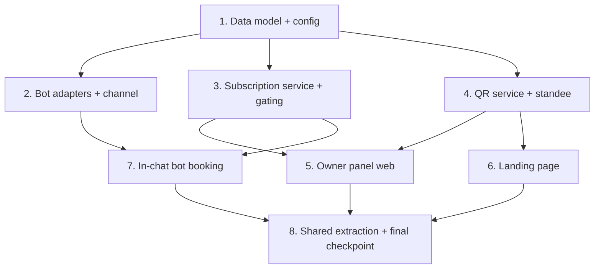

# Implementation Plan: Salon Platform Expansion

## Overview

این پلن، شش قابلیت `design.md` را افزایشی و پایین‌به‌بالا پیاده می‌کند: ابتدا مدل داده و پیکربندی (پایه)، سپس انتزاع آداپتور ربات و کانال اعلان، سپس سرویس اشتراک و گیت، سپس QR و استند، سپس سطوح وب (پنل صاحب سالن، لندینگ)، و در پایان رزرو داخل چت که روی همهٔ این‌ها سوار می‌شود. هر وظیفه خروجی خود را به کار قبلی متصل می‌کند تا کدِ یتیم نماند.

اصل حاکم: **بازاستفاده نه بازنویسی**. تمام رزروها از `BookingFlow.book` می‌گذرند، تمام پرداخت‌ها از `PaymentService`، تمام اعلان‌ها از `NotificationService`، و QR از کدک `@salon/shared`. تمام تغییرات API و دیتابیس افزایشی‌اند و قرارداد `dir="rtl"`/`lang="fa"` و هوک‌های تست موجود حفظ می‌شوند.

تست‌های مبتنی بر ویژگی با **fast-check** (حداقل ۱۰۰ تکرار) و با برچسب **Feature: salon-platform-expansion, Property N: ...** نوشته می‌شوند. زیروظیفه‌های علامت‌خوردهٔ `*` اختیاری (تست) هستند و برای MVP سریع‌تر قابل حذف‌اند؛ زیروظیفه‌های پیاده‌سازی هستهٔ هرگز اختیاری نیستند.

## Task Dependency Graph

```json
{
  "waves": [
    { "wave": 1, "tasks": ["1"] },
    { "wave": 2, "tasks": ["2", "3", "4"] },
    { "wave": 3, "tasks": ["5", "6", "7"] },
    { "wave": 4, "tasks": ["8"] }
  ],
  "dependencies": {
    "1": [],
    "2": ["1"],
    "3": ["1"],
    "4": ["1"],
    "5": ["3", "4"],
    "6": ["4"],
    "7": ["2", "3"],
    "8": ["5", "6", "7"]
  }
}
```



## Tasks

- [x] 1. Data model and configuration foundation
  - [x] 1.1 Add additive Prisma models and enums
    - Add `BotChat`, `BotSession`, `Subscription`, `SubscriptionPayment`, `QrScanEvent` and enums `BotPlatform`, `SubscriptionStatus`, `SubscriptionPlanKind`; add `source` value `bot` to `ApptSource`; add reverse relations to `Customer`, `StaffMember`, `Salon`
    - Generate the additive migration (no breaking changes to existing tables)
    - _Requirements: 1.1, 1.6, 3.1, 4.5_
  - [x] 1.2 Extend `config.ts` with new env-driven settings
    - Add `telegramBotToken`, `baleBotToken`, `botWebhookSecret`, and configurable subscription prices/trial days; follow the existing fail-fast/dev-default pattern; document in `.env.example`
    - _Requirements: 1.7, 1.8, 3.4, 8.1_
  - [x] 1.3 Migration/constraint tests
    - Assert new tables/enums exist and the unique constraints (`BotChat[platform,chatId]`, `Subscription[salonId]`) hold
    - _Requirements: 1.6, 3.1_

- [x] 2. Bot adapters and notification channel
  - [x] 2.1 Define `BotAdapter` interface and shared base
    - `OutboundBotMessage`/`InboundBotUpdate` types; a common base implementing send/parseUpdate with per-platform `baseUrl`/payload overrides
    - _Requirements: 1.1, 1.7_
  - [x] 2.2 Implement `Telegram_Adapter` and `Bale_Adapter`
    - Concrete adapters; `enabled` derived from presence of the env token; graceful disable when absent
    - _Requirements: 1.1, 1.7, 1.8_
  - [x] 2.3 Implement `Bot_Channel` behind `NotificationService`
    - Route OTP, reminders, and owner new-booking/cancellation notices through the bot when a `BotChat` exists; fall back to SMS and log to `NotificationLog`
    - _Requirements: 1.3, 1.4, 1.5_
  - [x] 2.4 Wire adapter selection in `composition-root.ts`
    - Mirror `selectSmsProvider`: real adapter when token present, disabled no-op otherwise
    - _Requirements: 1.8, 8.1_
  - [x] 2.5 Adapter + channel unit tests
    - Parse/send with a faked fetch; channel falls back to SMS when no `BotChat`; no token leaks in logs
    - _Requirements: 1.7, 8.1_

- [x] 3. Subscription service and gating
  - [x] 3.1 Implement `Subscription_Service` state machine
    - `startTrial`, `getStatus` (effective status with expiry/grace), and the trial→active→grace→expired transitions; default plans (14-day trial; monthly/quarterly/annual) with configurable prices
    - _Requirements: 3.1, 3.2, 3.3, 3.10, 3.12_
  - [x] 3.2 Implement purchase + activation via existing `PaymentService`
    - `initiatePurchase` (creates `SubscriptionPayment` + gateway redirect), `activateFromPayment` (idempotent), renewal that adds duration to remaining days
    - _Requirements: 3.4, 3.5, 3.6, 3.7, 3.11_
  - [x] 3.3 Implement `requireActiveSubscription` gating middleware
    - 402 `SUBSCRIPTION_REQUIRED` for `expired`; allow trial/active/grace; reads on `expired` allowed, writes blocked
    - _Requirements: 3.8, 3.9_
  - [x] 3.4 Subscription property + integration tests
    - **Property 4: subscription status exclusivity**, **Property 5: renewal without loss**, **Property 6: callback idempotency**, **Property 8: write gating**
    - **Validates: Requirements 3.1, 3.7, 3.9, 3.10, 3.11**

- [x] 4. QR service and standee
  - [x] 4.1 Implement `QR_Service`
    - `buildSalonQrPayload` (from existing `qrToken` + shared codec), `buildSalonQrUrl` (adds `utm_source=qr`), `recordScan`
    - _Requirements: 4.1, 4.2, 4.3, 4.4_
  - [x] 4.2 Wire scan counting on the public profile
    - Record a `QrScanEvent` when a visitor arrives with the campaign source param
    - _Requirements: 4.4, 4.5_
  - [x] 4.3 QR service tests
    - **Property 7: QR payload stability/round-trip**; campaign-url and scan-count assertions
    - **Validates: Requirements 4.1, 4.2, 4.4**

- [x] 5. Owner panel (web)
  - [x] 5.1 Owner panel shell and auth bootstrap
    - `/owner/*` code-split routes; reuse OTP login + tokens; bootstrap access token from stored refresh on load so a refresh keeps the owner signed in; RBAC via existing `Authorizer`
    - _Requirements: 2.1, 2.2, 2.3_
  - [x] 5.2 Extend admin pages into the panel
    - Reuse `ConfigurationPage`/`CalendarPage`/`AnalyticsPage`; preserve their testIDs and the dir/lang contract; apply governing UI tokens
    - _Requirements: 2.1, 7.1_
  - [x] 5.3 Subscription management page + gating UI
    - «اشتراک من»: show status/expiry, plan selection, purchase redirect; route `expired` to the renewal surface
    - _Requirements: 3.8, 3.9, 2.1_
  - [x] 5.4 QR + standee page
    - «QR و استند»: render the salon QR image, the campaign URL, and a print-friendly standee view (`@media print`)
    - _Requirements: 4.1, 4.3_
  - [x] 5.5 Owner panel component/page tests + axe
    - Testing Library + axe per the governing UI standard; preserved testIDs stay green
    - _Requirements: 7.1_

- [x] 6. Landing page (owner acquisition)
  - [x] 6.1 Build the standalone marketing landing page
    - Owner-focused hero + CTA → `/owner` sign-up; customer CTA → booking; built on the existing prerender/SEO foundation (content + meta + JSON-LD in initial HTML); dir/lang + `seo-skills.md`
    - _Requirements: 5.1, 5.2, 5.3, 5.4, 5.5_
  - [x] 6.2 Landing SEO/prerender tests
    - Assert indexable head + JSON-LD present in prerendered HTML; CTAs route correctly
    - _Requirements: 5.4_

- [x] 7. In-chat bot booking
  - [x] 7.1 Bot webhook routes and update dispatch
    - `POST /api/bots/telegram/:secret` and `/bale/:secret` (public, webhook-secret protected); normalize to `Bot_Service.handleUpdate`; always 200 to avoid retry storms
    - _Requirements: 1.1, 1.6, 8.1_
  - [x] 7.2 Conversational booking state machine
    - `BotSession`-backed steps service→date→slot→confirm; Jalali date + Persian digits; reuse `SchedulingEngine.getAvailability` and `BookingFlow.book` with `source: 'bot'`; in-chat OTP links a chat to a customer (`BotChat`)
    - _Requirements: 1.6, 6.6_
  - [x] 7.3 Held/redirect and confirmation handling
    - On `held` send the gateway link; on `confirmed` send details; never fabricate success
    - _Requirements: 1.6_
  - [x] 7.4 Bot booking property + integration tests
    - **Property 1: chat identity uniqueness**, **Property 2: single booking source**, **Property 3: no OTP/token leak**
    - **Validates: Requirements 1.6, 1.7, 6.6, 8.1**

- [x] 8. Shared extraction and final checkpoint
  - [x] 8.1 Consolidate shared logic in `@salon/shared`
    - Ensure domain types/Zod/Jalali/QR/theme tokens used by web + native + panel live in shared (no RNW for public/SEO pages); remove any duplication introduced
    - _Requirements: 6.1, 6.2, 6.3, 6.4, 6.5, 6.6_
  - [x] 8.2 Full build + test sweep
    - `packages/backend` (tsc + Jest), `packages/web` (tsc + vite + vitest incl. preserved suites), `packages/mobile` (tsc + Jest) all green; additive migration applies cleanly; no type errors
    - _Requirements: 8.1, 8.2_

## Notes

- توکن‌های ربات و کلیدهای پرداخت فقط از متغیرهای محیطی خوانده می‌شوند؛ نبودشان کانال/قابلیت را به‌آرامی غیرفعال می‌کند و تست‌ها به توکن واقعی نیاز ندارند.
- هیچ قرارداد API موجود نمی‌شکند؛ همهٔ مدل‌ها/enumها و مسیرها افزایشی‌اند.
- زیروظیفه‌های `*` (تست) برای MVP اختیاری‌اند؛ پیاده‌سازی هسته اختیاری نیست.
- شمارهٔ نیازمندی‌ها به `requirements.md` و شمارهٔ Propertyها به بخش Correctness Properties در `design.md` ارجاع دارند.
